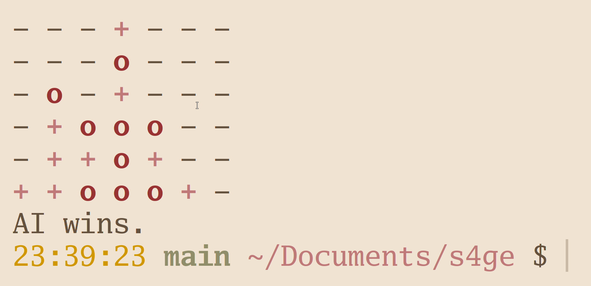

# s4ge

S4ge is a project developed to learn and implement minimax search w/ alpha-beta pruning for the game of Connect 4.



## Usage

```bash
git clone https://github.com/masroof-maindak/s4ge.git
make
./s4ge # or `make run`
```

## Acknowledgements

- [Sebastian Lague's Video](https://youtu.be/l-hh51ncgDI?feature=shared)
- [Wikipedia](https://en.wikipedia.org/wiki/Alpha%E2%80%93beta_pruning)
